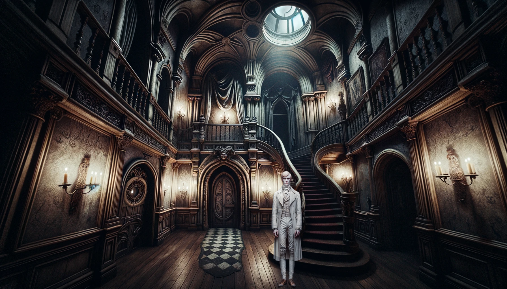
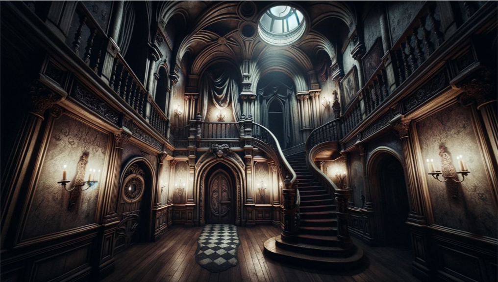
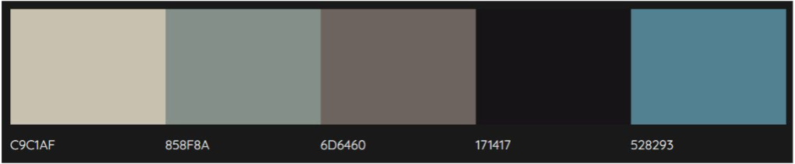

# GRIM REPO'S GRIM MANOR PROJECT

## Deployment

The project is deployed and can be accessed at [https://grim-manor.stephendawson.ie/](https://grim-manor.stephendawson.ie/).

## Criteria

In this section, we will briefly discuss how our team addressed the applicable criteria:

- 🎃 Creative design that enhances user-experience
- 🎃 Project fits theme of Halloween
- 🎃 Responsive and accessible for different screen sizes
- 🎃 Project is well planned using Github Projects
- 🎃 Overall project focus is realistic and has a sense of completeness

## Intro

You are presented with the image of a dark mansion on a rain-soaked night. Text invites you to seek refuge and enter.

Once indoors, a gloomy corridor with multiple doors greets you and a young, pale man appears. Your challenge is to complete a series of minigames to find clues as to what happened to the young man.

When you have completed the minigames, the clues you have gathered will tell the story of what happened to the young man, you can complete the exit quiz and you will have completed the game!

## Goal

### Problem Statement

Create a website which fits the theme of Halloween; is responsive and accessible for different screen sizes and has a positive user-experience.

## Objective(s)

### Creative design

We based our game around an image of an old, haunted manor house which was generated by AI. We based our colour scheme off of this image as it was so central to our design.

The image is a representation of the feeling we want the game to inspire. The soft-lighting from the candles have a slightly creepy and spooky undertone whilst not being too overtly frightening. The colour palette containing the soft hues of the blues and greys therefore reflect the eerie tones we are aiming whilst still creating enough of a contrast to be seen clearly by the user.

We chose the font Risque as our base font:

This was because we felt that it was in-keeping with the style of an old-time mansion whilst also being easily legible and interesting to look at.

### Moving around

On laptop/desktop, users will be able to click on the doors/stairs and access the mini-games.

On tablet/mobile screens, simply shrinking the image would make it too small and give a poor user experience so users will be able to pan left and right within the mansion to be able to see the doors and then access the mini-games in the same way.

### Responsiveness

In this project, we made the decision to display the full-sized image on both mobile and desktop for the main game. On mobile, it means that the user needs to pan the screen, which creates the feeling that they are looking around the house.

For the minigames, we made sure that these work on both mobile and desktop, so they are resized appropriately.

### Future improvements

If we were to take this website further, we would add more mini-games to upstairs doors and windows. The paintings and skylights, when clicked, would produce jumpscares where ghosts popped out. Apparitions of the pale young man would appear at random to give more of an eerie feel. Local storage would be utilised more so that, instead of an exit quiz which you had to click on, when you completed all of the mini-games the game would automatically generate the exit questions allowing you to be freed from the house. The games would then be replayable but with more general answers rather than story specific answers.

We would make the website more accessible to screen readers by using aria-labels and incorporating text to speech technology.

### Planning

We used agile methodologies on Github to plan our project. We did this by:

- **Appointing a Scrum Master:** Stephen acted as Scrum Master and lead the project management.
- **Setting up daily meetings:** We met twice a day to ensure that we were all up to date on tasks and able to support each other.
- **Using a Git Hub Project Board:** We created user stories to help keep us up to date on tasks
- **Frequent testing:** We deployed our project on Friday and frequently tested our project to ensure that bugs were being addressed quickly

### Target Audience

We decided that our project would be spooky but not ‘scary’. This means that the website has a distinct Halloween feel but is accessible across a wider range of ages and temperaments.

Although younger children might find the overall design of the website to be frightening, the mini-games themselves are accessible to children of approximately 8 years and up.

The games have the ability to be replayed as, once the clues have been solved, the local memory will recognise this and allow the games to become standalone.

### Benefits

The user experiences enjoyment of the spooky story through interactive mini-games. When they have collected all the clues, they can solve the mystery and have a sense of completion to the game.

## Tech

We used:

- Svelte
- SvelteKit
- HTML
- CSS
- Typescript
- Hover.css

We leveraged the browser APIs for locale storage and audio (for music/sounds).

## Credits

- <a href="https://openai.com/dall-e-2">Dall-E</a> for AI generated images
- <a href="https:/FontsBlogs.com">FontsBlogs.com for Ouija Font in Hangman game
- <a href="https:/Balsamiq.com">Balsamiq</a> for wireframes
- <a href="https://Freesound.org">Freesound.org</a> for audio clips
- <a href="https://fonts.google.com/">Google Fonts</a> for base font ‘Risque’
- <a href="https://obsproject.com/welcome">OBS</a> for screen recording software
- <a href="https://www.istockphoto.com/">iStock photos</a> for memory minigame images
- <a href="https://favicon.io/emoji-favicons/ghost">favicon.io</a> for favicon

## The Team

- **Samuel Anderson - Front-end development** [GitHub](https://github.com/samuelandersoncodes) <a href="https://www.linkedin.com/in/samuel-anderson-codes/">LinkedIn</a>
- **Armando Urquiola Cabrera - Front-end development** [GitHub](https://github.com/patchamama) <a href="https://www.linkedin.com/in/urquioladev/">LinkedIn</a>
- **Stephen Dawson - Scrum Master, Front-end development** [GitHub](https://github.com/stephendawsondev) <a href="https://www.linkedin.com/in/sdstephendawson/">LinkedIn</a>
- **Emma Lamont - Storytelling, documentation, presentation** [GitHub](https://github.com/elamont174) <a href="https://www.linkedin.com/in/emma-lamont/">LinkedIn</a>
- **Jorgen Lovbakke - Front-end development** [GitHub](https://github.com/JL-14) <a href="https://www.linkedin.com/in/jorgen-lovbakke/">LinkedIn</a>
